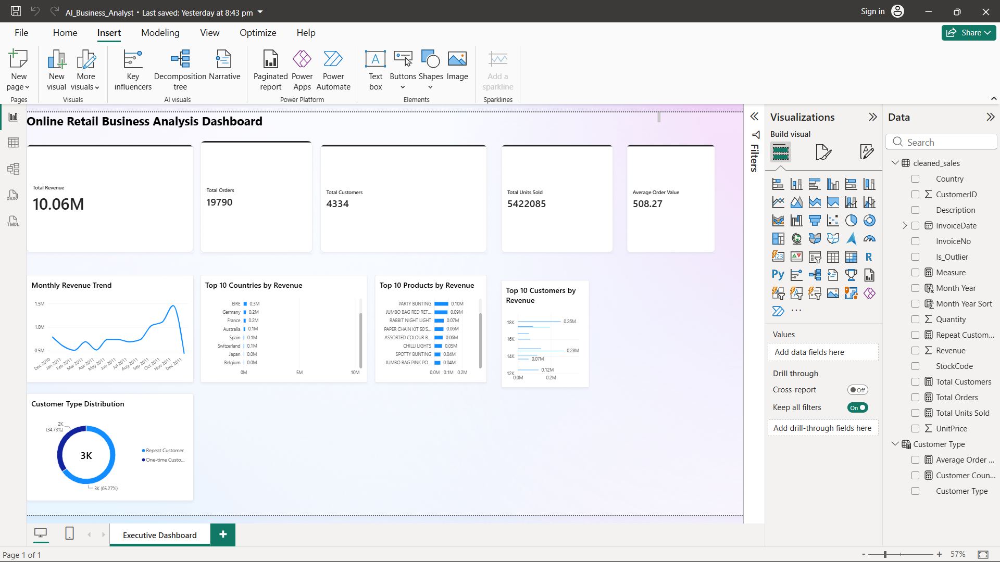

# Online Retail Business Analysis

## Project Overview

This project analyzes online retail transaction data to identify sales trends, customer behavior, product performance, and business opportunities.

The analysis combines **Python, SQL, Power BI, and AI-assisted analysis** to transform raw transaction data into actionable business insights and an interactive executive dashboard.

### Tools & Technologies

- Python — Data cleaning and exploratory data analysis
- Pandas — Data manipulation and analysis
- SQL — Business queries and KPI analysis
- Power BI — Interactive dashboard and visualization
- Excel — Source dataset
- AI-assisted analysis — Business interpretation and recommendations using ChatGPT

## Key Performance Indicators

| KPI | Value |
|---|---:|
| Total Revenue | £10.06M |
| Total Orders | 19,790 |
| Total Customers | 4,334 |
| Total Units Sold | 5,422,085 |
| Average Order Value | £508.27 |
| Repeat Customers | 2,829 (65.27%) |
| One-time Customers | 1,505 (34.73%) |

## Business Insights

### 1. Strong seasonal sales performance

November 2011 was the strongest month, generating approximately **£1.51M in revenue**.

Insight: Sales increased significantly toward the end of the year, suggesting strong seasonal demand.

> **Note:** December 2011 contains data only through December 9, so it should not be compared directly with a complete month.

### 2. The UK is the core market

The UK generated approximately **£8.53M in revenue**, making it the largest market by a wide margin.

Insight: The UK is the primary revenue market and should remain a key focus for inventory planning and customer retention.

### 3. Strong customer repeat rate

Approximately **65.27% of customers were repeat customers**, while 34.73% purchased only once.

Insight: The business demonstrates strong customer retention, while the one-time customer segment represents an opportunity for targeted retention campaigns.

### 4. Revenue concentration among high-value customers

The top 10 customers generated approximately **£1.41M**, representing about **14% of total revenue**.

**Insight:** High-value customers contribute meaningfully to overall revenue and could be prioritized through loyalty and retention strategies.

### 5. International markets show high-value opportunities

The Netherlands recorded an average order value of approximately **£3,053**, compared with approximately **£476 in the UK**.

**Insight:** Although some international markets have lower order volumes, their higher average order values may indicate opportunities for targeted international growth.

### 6. Product performance varies significantly

A small group of products generated a substantial share of product revenue, with **REGENCY CAKESTAND 3 TIER** ranking as the highest-revenue product.

**Insight:** High-performing products can be prioritized for inventory availability, promotions, and seasonal merchandising.

## AI-Assisted Business Insights

<<<<<<< Updated upstream
AI was used as a business analysis assistant to interpret validated findings from Python, SQL, and Power BI.

The AI-assisted analysis helped:

- Interpret key business trends and customer behavior.
- Identify potential business opportunities.
- Translate analytical findings into actionable recommendations.
- Support decision-making based on validated data.

The AI outputs were reviewed against the underlying analytical results to ensure that recommendations were supported by the data.
=======
This section uses AI-assisted analysis to interpret validated business metrics and translate analytical findings into actionable business recommendations.

### 1. Strong seasonal demand in November

November 2011 generated the highest monthly revenue at approximately £1.51M.

**Business interpretation:**  
The business experienced strong year-end demand, suggesting a seasonal sales pattern.

**Recommendation:**  
Increase inventory readiness, marketing activity, and promotional planning ahead of the November peak.

### 2. The United Kingdom is the core market

The United Kingdom generated approximately £8.53M in revenue, making it the primary market.

**Business interpretation:**  
The UK represents the company's strongest and most established customer base.

**Recommendation:**  
Continue prioritizing the UK while using international markets as opportunities for controlled expansion.

### 3. Strong customer retention opportunity

Repeat customers account for 65.27% of identified customers, while 34.73% are one-time customers.

**Business interpretation:**  
A substantial repeat-customer base indicates good customer retention, while the one-time segment provides an opportunity for further engagement.

**Recommendation:**  
Use personalized offers, follow-up campaigns, and loyalty initiatives to convert more one-time customers into repeat buyers.

### 4. High-value customers contribute significantly to revenue

The top 10 customers contribute approximately 14.03% of total revenue.

**Business interpretation:**  
A relatively small group of high-value customers makes a meaningful contribution to overall sales.

**Recommendation:**  
Monitor high-value customers closely and develop retention strategies to reduce the risk of losing important accounts.

### 5. International markets show high-value potential

The Netherlands has an average order value of approximately £3,053, significantly higher than the UK's approximately £476.

**Business interpretation:**  
Although the Netherlands has much lower order volume than the UK, its customers generate substantially larger average orders.

**Recommendation:**  
Investigate the Netherlands market further to understand customer segments, product preferences, and opportunities for targeted expansion.

### 6. Product performance can guide inventory decisions

REGENCY CAKESTAND 3 TIER is the highest-revenue product in the analyzed dataset.

**Business interpretation:**  
A small number of products generate a significant amount of sales and can be important drivers of revenue.

**Recommendation:**  
Prioritize inventory availability and promotional planning for consistently high-performing products.

### AI Analysis Approach

The AI layer was used to translate validated analytical results into business-oriented interpretations and recommendations.
>>>>>>> Stashed changes

**Workflow:**

Data → Python EDA → SQL Analysis → Power BI → AI Interpretation → Business Recommendations

<<<<<<< Updated upstream

=======
AI outputs were reviewed against the underlying analytical results to avoid unsupported conclusions.
>>>>>>> Stashed changes

## Business Recommendations

Based on the analysis, the following actions could help improve business performance:

1. **Focus on customer retention**
   - Target one-time customers with personalized offers, email campaigns, and loyalty incentives.

2. **Prepare for seasonal demand**
   - Increase inventory and marketing efforts ahead of the November/holiday sales period.

3. **Protect high-value customers**
   - Develop loyalty programs and personalized experiences for customers with consistently high purchase value.

4. **Explore high-value international markets**
   - Investigate markets with high average order values, such as the Netherlands, for targeted expansion.

5. **Prioritize high-performing products**
   - Maintain adequate inventory for top-revenue products and use them in promotional and seasonal campaigns.

6. **Monitor business performance regularly**
   - Use the Power BI dashboard to track revenue, orders, customers, product performance, and customer retention over time.
<<<<<<< Updated upstream
=======

>>>>>>> Stashed changes
## Project Workflow

The project followed these main stages:

1. **Data Collection**
   - Used the UCI Online Retail dataset containing retail transaction records.

2. **Data Cleaning**
   - Identified missing values and invalid transaction records.
   - Removed transactions with non-positive unit prices.
   - Separated sales transactions from cancelled transactions.
   - Investigated unusually large quantity values.
   - Excluded operational entries such as postage and manual adjustments from product-level analysis.

3. **Exploratory Data Analysis**
   - Analyzed revenue trends over time.
   - Examined customer purchasing behavior.
   - Identified top-performing products and customers.
   - Compared performance across countries.

4. **SQL Analysis**
   - Created a SQLite database from the cleaned sales data.
   - Used SQL queries to calculate KPIs and analyze customer and country performance.

5. **Power BI Dashboard**
   - Built an interactive executive dashboard.
   - Created KPI cards, revenue trends, product analysis, country analysis, customer analysis, and customer-type segmentation.

<<<<<<< Updated upstream
6. **Business Insights**
   - Translated analytical findings into business recommendations related to customer retention, seasonal planning, product performance, and international opportunities.
=======
6. **AI-Assisted Business Insights**
   - Used ChatGPT to interpret validated analytical findings.
   - Translated data-driven results into business-oriented recommendations.
   - Reviewed AI-generated recommendations against the underlying analysis.

>>>>>>> Stashed changes
## Power BI Dashboard

The project includes an executive Power BI dashboard designed to provide a high-level view of retail business performance.

The dashboard includes:

- Total Revenue
- Total Orders
- Total Customers
- Total Units Sold
- Average Order Value
- Monthly Revenue Trend
- Top 10 Countries by Revenue
- Top 10 Products by Revenue
- Top 10 Customers by Revenue
- Customer Type Distribution

The dashboard helps decision-makers quickly identify sales trends, customer behavior, high-performing products, and important markets.

## Dataset

The project uses the **UCI Online Retail dataset**, which contains transaction-level data from a UK-based online retailer between December 2010 and December 2011.

**Source:** UCI Machine Learning Repository

## Project Files

| File | Description |
|---|---|
| `Day1_EDA.ipynb` | Python data cleaning and exploratory data analysis |
| `AI_Business_Insights.ipynb` | AI-assisted business insights and recommendations |
| `data/cleaned_sales.csv` | Cleaned sales data used for analysis and Power BI |
| `AI_Business_Analyst.pbix` | Power BI executive dashboard |
| `dashboard.png` | Preview image of the Power BI dashboard |
| `README.md` | Project documentation |

> **Note:** The original Excel dataset and local SQLite database are excluded from the repository. The analysis uses the cleaned `cleaned_sales.csv` file, while the SQLite database can be recreated locally from the cleaned data.
<<<<<<< Updated upstream
> 
=======

>>>>>>> Stashed changes
## Skills Demonstrated

- Data Cleaning & Preparation
- Exploratory Data Analysis (EDA)
- Python & Pandas
- SQL
- Power BI
- Data Visualization
- KPI Development
- Customer Segmentation
- Business Analysis
<<<<<<< Updated upstream
- Business Insights & Recommendations
=======
- AI-Assisted Business Insights
- Business Insights & Recommendations
>>>>>>> Stashed changes
